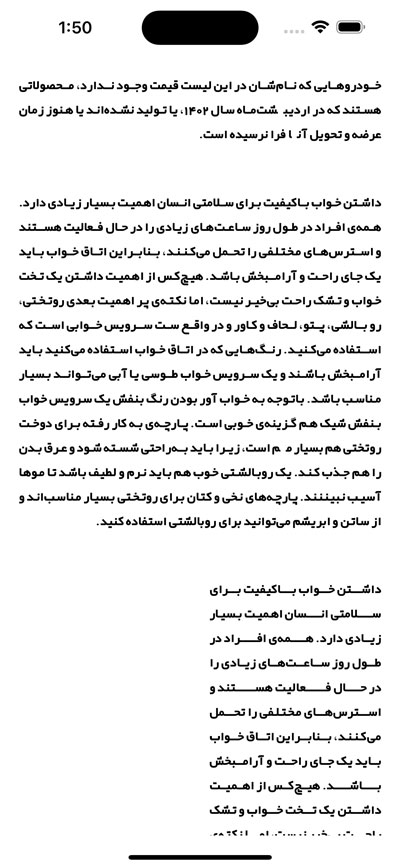
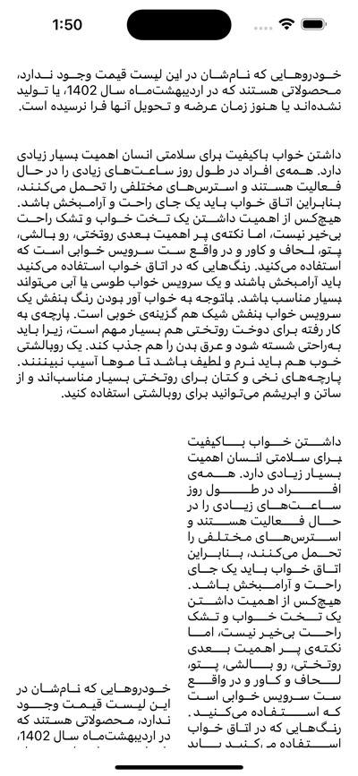
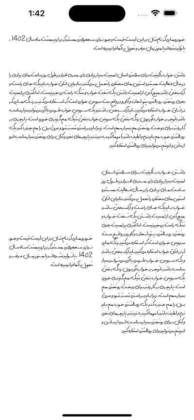
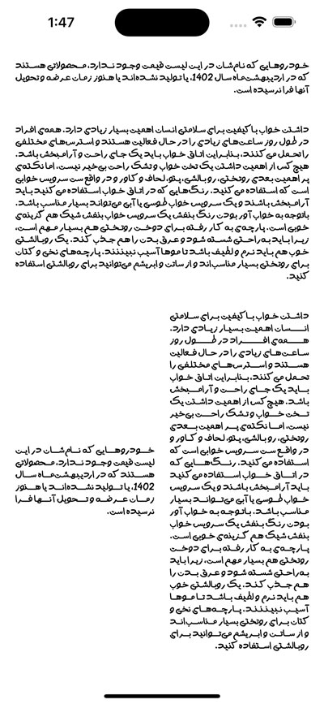
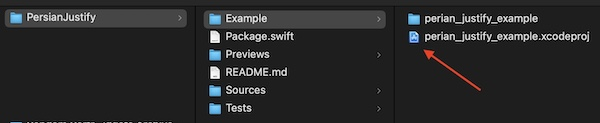

# Persian Justify 

### Not very efficient way to justify Hebrew languages in iOS using the Swift language and CoreText.


   
| ⬇️ | ⬇️ |
| --- | --- |
|||
|||

### Usage:
##### ✅ Add PersianJustify using SPM
##### ✅ Import PersianJustify in your class and use it like so:
```ruby
yourLabel.numberOfLines = 0
yourLabel.attributedText = yourText.toPJString(in: yourLabel)
```


### Example Project:

Navigate to the "Example" folder with finder and open the example project while the main project is not open in XCode.

### Problems:
- Not optimized (yet) and consumes a lot of energy.
- Some weird UI issues in text with some fonts.
- Not tested with all Hebrew languages.
- It needs more tests.

#### PS:
##### I accept the helps to fix the bugs and improve the functionality with open arms.

### Credits:
I'm very thankful to my dear brother and teacher [MR.Mojtaba Hosseini](https://github.com/MojtabaHs) to be a big part of this.'


### License:
PersianJustify is released under the MIT license. See [LICENSE](https://github.com/HappyIosDeveloper/PersianJustify/blob/main/LICENSE) for details. 
