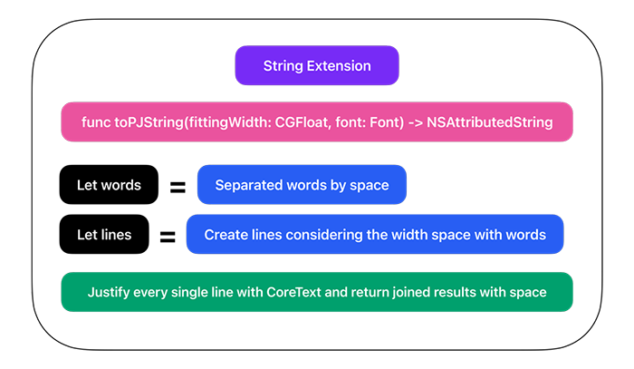

# Persian Justify 

Justify Hebrew languages in iOS using the Swift language and CoreText.


    [](https://github.com/HappyIosDeveloper/PersianJustify/actions/workflows/swift.yml)
| ⬇️ | ⬇️ |
| --- | --- |
|||
|||


### Usage:
##### ✅ Add PersianJustify using SPM
##### ✅ Import PersianJustify in your class and use it like so:
```ruby
yourLabel.numberOfLines = 0
yourLabel.attributedText = yourText.toPJString(in: yourLabel)
```


### Example Project:

Navigate to the "Example" folder with finder and open the example project while the main project is not open in XCode.


### How it works?
Simple - It breaks the words into lines base of the provided width and then justifies the lines individually using CoreText.




### Problems:
- Not optimized (yet) and consumes a lot of energy.
- Some weird UI issues in text with some fonts.
- Not tested with all Hebrew languages.
- It needs more tests.


#### Contribution:
##### I accept the helps to fix the bugs and improve the functionality with open arms, but please consider these conventions:
- Don't change the project structure and reconstruct everything. 
- To streamline the review process and make it easier to merge, consider breaking down the changes into smaller, more focused pull requests.
- Each PR should be small in scope, addressing only one task (e.g., feature, refactor, documentation) to allow maintainers to choose what to merge and where.
- Commits should follow a logical flow, making the commit history easy to follow and enabling project builds for each individual commit.
- Avoid unnecessary back-and-forth commits (such as add -> delete -> add) that can occur during development.
- Tests should pass locally and in continuous integration.
- Code should adhere to linting and styling rules according to the repository's configuration.
- Ensure that each PR includes clear and concise documentation explaining the changes made and any relevant context for reviewers.
- Follow a consistent naming convention for branches, commits, and PR titles to facilitate navigation and understanding of the project's history.
- Prioritize backward compatibility and consider the impact of changes on existing functionality, dependencies, and users.
- Strive for simplicity and readability in code, favoring clarity and maintainability over complexity.
- Maintain a clean and organized project structure, with clear separation of concerns and minimal coupling between components.
- Foster an inclusive and respectful environment, welcoming contributions from developers of all backgrounds and skill levels.


### Credits:
I'm very thankful to my dear brother and teacher [MR.Mojtaba Hosseini](https://github.com/MojtabaHs) to be a big part of this.'


### License:
PersianJustify is released under the MIT license. See [LICENSE](https://github.com/HappyIosDeveloper/PersianJustify/blob/main/LICENSE) for details. 
